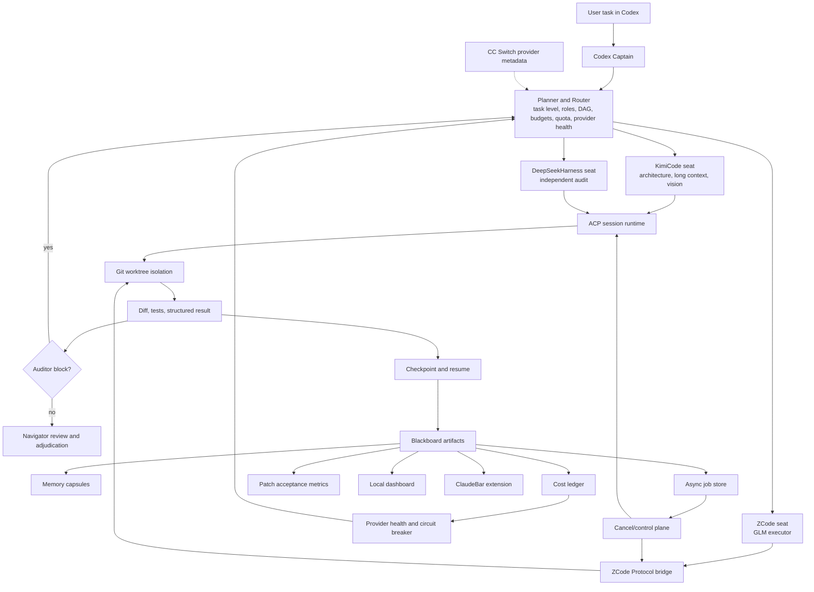

# codex-moa

Codex MOA keeps Codex as the captain while delegating work to three heterogeneous agent harnesses:

- **KimiCode** for architecture, long context, vision, and second opinions.
- **ZCode** for code execution with GLM fast/deep models.
- **DeepSeekHarness** for independent audit and verification.

The Codex plugin exposes one local MCP server. The MCP server owns routing, subprocess execution, artifacts, redaction, and scheduling hints.

## What it does

Codex MOA turns Codex into the captain of a heterogeneous multi-model runtime:

- Plans a task into a dependency-aware DAG.
- Selects models by capability, cost tier, quota, health, and task risk.
- Runs KimiCode, ZCode, and DeepSeekHarness as independent ACP or CLI seats.
- Isolates write-capable executors in Git worktrees.
- Captures structured execution and audit results.
- Repairs auditor `block` findings in a bounded second round.
- Persists checkpoints so partial runs can resume without repeating completed nodes.
- Tracks budgets, token cost, provider health, patch acceptance, and seat quality.
- Exposes async jobs, cancellation, a local dashboard, and ClaudeBar visibility.
- Keeps Codex as the final judge and writer; external agents are never authorities.

## Architecture




## Status

This repository currently implements the MVP control plane:

- Codex plugin manifest and MCP configuration.
- `codex-moa` Skill.
- MCP tools: `moa_doctor`, `moa_models`, `moa_ccswitch`, `moa_quota`, `moa_health`, `moa_plan`, `moa_run`, `moa_start`, `moa_job_status`, `moa_job_wait`, `moa_job_cancel`, `moa_worktrees`, `moa_retention`, `moa_patch_metrics`, `moa_provider_recovery`, `moa_delegate`, `moa_audit`, `moa_interrupt`, `moa_schedule`, `moa_captain`, `moa_evolve`.
- Five explicit models: `kimi-k3`, `kimi-2.8`, `GLM-5.3`, `GLM-5.3-flash`, `DeepSeek-flash`.
- CC Switch 3.20.3 native Responses direct-mode detection, with routing retained only for Chat/Anthropic upstreams.
- CC Switch routing audit: `npm run ccswitch:routing`.
- KimiCode, ZCode, and DeepSeekHarness adapters.
- Blackboard artifacts under `~/.codex-moa/blackboard`.
- Time policy for DeepSeek peak/off-peak and the temporary GLM night campaign.
- Real ACP smoke harness for KimiCode, DeepSeekHarness, and the ZCode app-server bridge.
- Task DAG checkpoint/resume, cost ledger, provider health, routing A/B experiments with automatic rollback.
- Local control dashboard, interrupt/cancel requests, and richer ClaudeBar runtime status sections.
- Node test suite.

External writes are disabled by default. A seat cannot write unless `allowWrite` is true and the seat explicitly sets `autoApprove`.

## Prerequisites

- Node.js 20 or newer.
- Codex with plugin and MCP support.
- KimiCode CLI installed and authenticated.
- ZCode installed at `/Applications/ZCode.app`, or override the command in `config/local.json`.
- DeepSeekHarness installed as `dsh` and authenticated.
- Git worktrees or disposable copies for code-writing seats.

## Documentation

- `docs/PREREQUISITES.md`
- `docs/ARCHITECTURE.md`
- `docs/ROADMAP.md`
- `docs/UPGRADE-SAFETY.md`
- `docs/QUOTA.md`
- `docs/CCSWITCH.md`
- `docs/CAPTAIN.md`
- `docs/EVOLUTION.md`
- `docs/REASONING.md`
- `docs/LIMITS.md`
- `docs/CONTINUITY.md`
- `docs/MEMORY.md`
- `docs/RUNTIME.md`

## Local setup

```bash
cd /path/to/codex-moa
npm install
npm test
npm run doctor
npm run upgrade-check
```

`npm run doctor` checks command availability, versions, the ZCode script path, and the DSH headless profile.

## Install as a local Codex plugin

The repository includes a development marketplace at `dev-marketplace/`.

```bash
codex plugin marketplace add /path/to/codex-moa/dev-marketplace
codex plugin add codex-moa@codex-moa-local
```

Start a new Codex task after installation so the plugin Skill and MCP tools are loaded.

## Configuration

Default configuration lives in `config/default.json`, `config/models.json`, and `config/schedule.json`.

Create `config/local.json` to override machine-specific command/provider values. Start from `config/local.example.json`. Use `config/models.local.json` or `config/schedule.local.json` for model and schedule overrides. These files are ignored by git.

Example:

```json
{
  "commands": {
    "kimi": { "command": "kimi", "args": [] },
    "zcode": {
      "command": "node",
      "args": ["/Applications/ZCode.app/Contents/Resources/glm/zcode.cjs"]
    },
    "dsh": { "command": "dsh", "args": [] }
  },
  "profiles": {
    "dsh": {
      "fast": "codex-dsh-audit-fast",
      "deep": "codex-dsh-audit-deep"
    }
  },
  "zcode": {
    "headlessProvider": "builtin:bigmodel-coding-plan",
    "headlessHome": "~/.codex-moa/zcode-home"
  }
}
```

## Tool usage

Plan without execution:

```text
moa_plan(task="Refactor the parser", stakes="medium")
```

List canonical models:

```text
moa_models()
```

Delegate with explicit models selected by Codex:

```text
moa_delegate(
  task="Review this migration and implement the safest fix",
  cwd="/path/to/repo",
  assignments=[
    {"model": "kimi-k3", "role": "architect"},
    {"model": "GLM-5.3", "role": "executor"},
    {"model": "DeepSeek-flash", "role": "auditor"}
  ]
)
```

Run a read-only review:

```text
moa_run(task="Review the parser changes", cwd="/path/to/repo", mode="review", stakes="medium")
```

Run a DeepSeekHarness audit:

```text
moa_audit(task="Audit the current diff", cwd="/path/to/repo", deep=false)
```

Check current pricing policy:

```text
moa_schedule()
```

## Captain model

Codex keeps the model selected by the user. Use `moa_captain` to inspect the resolved captain, or pass `captainModel` explicitly. Codex MOA never overrides the Codex main model.

## Async jobs

Long runs can start in the background and survive the MCP request boundary:

```text
moa_start(task="...", cwd="/repo", assignments=[...])
moa_job_status(jobId="job-...")
moa_job_wait(jobId="job-...", timeoutMs=30000)
moa_job_cancel(jobId="job-...", reason="superseded")
```

Job state is persisted under `~/.codex-moa/jobs/<job-id>/`. The worker process owns the run; the MCP server only starts, observes, waits, or requests cancellation. Async jobs reject per-seat `env` values so credentials are not persisted; use provider configuration or synchronous `moa_run` for seat-local environment variables.

## Retention and compaction

Plan or apply retention for blackboard runs, jobs, managed worktrees, cost ledger, and routing history:

```bash
npm run retention
npm run retention -- --apply --write
```

```text
moa_retention(action="plan")
moa_retention(action="apply", allowWrite=true, dryRun=false)
```

Managed worktrees are only pruned when clean by default. Active jobs and running seats are always protected.

## Patch acceptance metrics

Worktree check/apply/revert operations record outcomes:

```text
moa_patch_metrics()
npm run patch:metrics
```

Metrics include apply acceptance rate, failure/conflict rate, revert rate, and per-seat/per-model patch performance.

## Provider recovery

Provider circuits open after repeated failures, classify auth/rate-limit/timeout/provider errors, and track p50/p95 latency:

```text
moa_provider_recovery(action="status")
moa_provider_recovery(action="probe", providers=["zai"], force=false)
npm run provider:recovery -- --probe
```

Half-open providers are probed automatically by `moa_provider_recovery` or `moa_health(probeProviders=true)` and close after a successful probe.

## Budget enforcement

Task-level budgets can stop a DAG before downstream layers or repair rounds continue:

```text
moa_run(
  task="...",
  cwd="/repo",
  budget={
    "enforce": true,
    "maxTokens": 2000000,
    "maxEstimatedUsd": 20,
    "maxDurationMs": 3600000,
    "maxContextUsed": 500000
  }
)
```

Budget checks happen before each DAG layer and before repair rounds. Already-running seats are allowed to finish; unstarted nodes are marked blocked with `budgetExceeded` details.

## Provider health routing

Automatic plans avoid providers marked `critical` or `inactive`. A healthy model with the same tier is selected when available; otherwise dispatch is refused unless `allowUnhealthy=true` is set. Explicit assignments are never silently rerouted.

## Structured results and repair

Execution and audit seats are parsed into structured results. Auditor `block` findings are normalized into `P0/P1/P2` findings and can trigger a bounded repair round:

```text
Round 1: executor → auditor(block)
Round 2: executor receives findings → auditor re-checks
```

The final Navigator review consumes structured findings, parse errors, conflict markers, and partial writes. Checkpoint nodes retain per-round result history.

## Worktree lifecycle

Inspect worktree state and patches:

```text
moa_worktrees(action="list", cwd="/repo")
moa_worktrees(action="inspect", path="/path/to/worktree")
moa_worktrees(action="check_patch", cwd="/repo", patchPath="/path/to/change.patch")
```

Mutating actions require `allowWrite=true`:

```text
moa_worktrees(action="apply_patch", cwd="/repo", patchPath="...", allowWrite=true)
moa_worktrees(action="revert_patch", cwd="/repo", patchPath="...", allowWrite=true)
moa_worktrees(action="remove", path="...", allowWrite=true, force=false)
moa_worktrees(action="prune", cwd="/repo", dryRun=true)
```

Worktree inspection includes tracked and untracked files, conflict markers, binary diff size, and `partialWrite` when a failed/cancelled seat left changes.

## Persistent ACP runtime

Seats can opt into persistent ACP processes with `runtime="acp"` for KimiCode and DSH. ZCode does not expose ACP natively, so codex-moa bridges the ZCode Protocol `app-server` into the same seat contract.

```bash
npm run acp:smoke -- --harness all --json
npm run acp:smoke -- --harness dsh
```

## Runtime governance

Seat Registry, worktree isolation, Context Pack, Navigator review, memory distillation, DAG checkpoint/resume, cost ledger, provider health, and cancellation are available. See `docs/RUNTIME.md`.

```bash
npm run health
npm run dashboard
npm run control -- status
npm run control -- cancel --task-id TASK_ID --seat SEAT_ID
```

## Durable memory

Use `memoryKey` or `continuityKey` to persist decisions, facts, files, tests, failed attempts, and episodes outside the model context. See `docs/MEMORY.md`.

## Context, limits, and continuity

Balanced context/output budgets and continuity keys are supported. See `docs/LIMITS.md` and `docs/CONTINUITY.md`.

## Reasoning effort

Reasoning effort is selected per sub-agent and can be explicit or task-policy driven:

```bash
npm run ccswitch:reasoning
```

See `docs/REASONING.md` for provider mappings and enforcement channels. Patch missing CC Switch reasoning metadata with `npm run ccswitch:patch-reasoning:write`.

## Controlled self-evolution

MCP can propose and inspect changes, but approval/apply/rollback are terminal-only so Codex cannot self-approve:

```bash
npm run evolve:status
npm run evolve:propose
```

Only the user-level `~/.codex-moa/evolution-policy.json` overlay can be auto-applied in v1; it survives upgrades. Code changes remain recommendations for human/Codex implementation.

## CC Switch integration

CC Switch remains the source of truth for provider/model profiles and Skill enablement:

```bash
npm run ccswitch:snapshot
npm run ccswitch:skill:write
```

The plugin reads CC Switch metadata and never edits `cc-switch.db`.

## Quota visibility

```bash
npm run quota
npm run health
```

This refreshes KimiCode, Z.ai/GLM, and DeepSeek quota into `~/.codex-moa/quota.json`.

For macOS menu-bar and Notch visibility, install the included ClaudeBar extension:

```bash
npm run claudebar:install:write
```

Then restart ClaudeBar.

## Design lineage and credits

This project is an independent Codex-native orchestration runtime. Its design borrows concepts from open-source agent infrastructure and from the author's own MoA experiments.

### Author's prior projects

- [pi-moa](https://github.com/Flipped929/pi-moa): double-plane captain/governance design, role-based dispatch, structured task/result cards, Navigator review, guard boundaries, and cost-tiered execution.
- [dsh-moa](https://github.com/Flipped929/dsh-moa): persistent seats, roster-style role files, subscription-first model routing, cross-family auditing, asynchronous Navigator checks, result-card persistence, redaction, and provider/cost visibility.
- DeepSeekHarness (`dsh`): its profile, session, tool, permission, and ACP behaviors informed the DSH adapter, persistent session handling, and headless audit profile design.

### Open-source projects and specifications

- [Agent Client Protocol (ACP)](https://agentclientprotocol.com/) and `@agentclientprotocol/sdk`: native KimiCode/DSH session execution, updates, resume, and cancellation.
- [Model Context Protocol (MCP)](https://modelcontextprotocol.io/) and `@modelcontextprotocol/sdk`: the Codex-facing tool surface.
- [OpenAI Codex](https://github.com/openai/codex): plugin/MCP integration patterns and the captain-centric workflow.
- KimiCode CLI and ZCode app-server: seat execution, session semantics, and Model/Agent protocol behavior.
- [ClaudeBar](https://github.com/tddworks/ClaudeBar): extension manifest and probe model used for menu-bar/Notch visibility.
- [CC Switch](https://github.com/farion1231/cc-switch): source-of-truth metadata for provider/model profiles and Skill enablement.
- `ccusage` and related local token monitors: conceptual reference for local-first cost and usage accounting. Codex MOA keeps provider quota/health checks separate from local token estimates.

No source project is treated as authoritative over Codex's final verification. External agents remain untrusted workers, and every borrowed mechanism is reimplemented behind the local MCP/runtime contracts in this repository.

## Safety

- Codex remains the final writer.
- Auditors are read-only.
- External executors use isolated worktrees.
- Secrets are stripped from child-process environments unless explicitly allowlisted.
- Commands use `spawn` with `shell: false`.
- Logs and artifacts are redacted.
