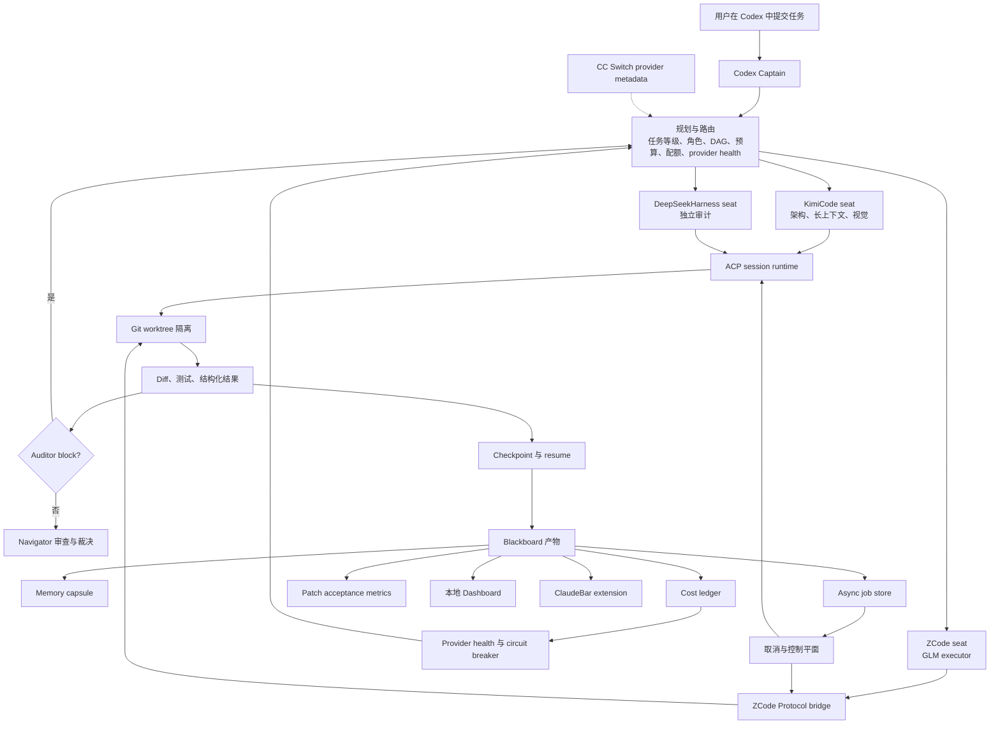

# codex-moa

[English](README.md) | **简体中文**

Codex MOA 让 Codex 继续担任 captain，同时把任务分派给三个异构 agent harness：

- **KimiCode**：架构设计、长上下文、视觉理解和第二意见。
- **ZCode**：基于 GLM fast/deep 模型的代码执行。
- **DeepSeekHarness**：独立审计、验证和对抗性检查，也可承载 Kimi、GLM provider 模型。

Codex 插件只暴露一个本地 MCP server。路由、DAG 调度、子进程执行、worktree、产物、脱敏、预算、健康检查和调度策略都由这个 server 负责。

Codex 页面当前选择的模型始终是 captain。只有调用方明确知道页面级模型时才传入 `captainModel`；否则插件记录为 `codex-selected`，不会用全局 `config.toml`、环境变量或 CC Switch 卡片猜测当前任务的模型。

Captain 不限于 GPT 或 OpenAI Provider。插件支持持久模式 `off`、`auto`（默认）和 `force`。规范命令统一为英文：`$codex-moa on|off|auto|status`；`$codex-moa <任务>` 只对当前任务强制启用，不改变持久模式；`$codex-moa optimize` 启动提案优先的自优化流程。详见 `docs/MODES.md`。

## 它解决什么问题

单模型完成复杂工程任务时通常面临四类问题：

1. **上下文墙**：长会话越来越大，最终被 compaction 或上下文窗口截断。
2. **旗舰模型做机械工作**：搜索、格式化、机械修改不应该消耗最贵的模型额度。
3. **同模型自审没有真正异构性**：同一家族的模型会共享系统性盲区。
4. **纯路由没有治理**：只把任务分出去并不等于可恢复、可审计、可控制。

Codex MOA 的解法：

- Codex 只做 captain：拆解、判断、裁决、最终写入。
- 外部模型按角色进入独立 seat。
- 写操作进入 Git worktree。
- DAG 节点持久化 checkpoint，可恢复执行。
- executor 和 auditor 返回结构化结果。
- auditor `block` 可以触发有上限的修复轮。
- token、费用、上下文、wall time 有任务预算。
- provider quota、错误、延迟和 circuit breaker 参与路由。
- 所有关键状态进入 blackboard、memory、cost ledger 和 job store。
- Codex 始终保留最终裁决和最终写入权。

## 总体架构



## 当前能力

- Codex 插件 manifest、Skill 和本地 MCP server。
- 五个规范模型：`kimi-k3`、`kimi-2.8`、`GLM-5.3`、`GLM-5.3-flash`、`DeepSeek-flash`。
- KimiCode、ZCode、DeepSeekHarness adapter。
- 原生 Kimi/DSH ACP runtime，以及 ZCode Protocol bridge。
- Task DAG、分层依赖、checkpoint 和 resume。
- 自动 Git worktree 隔离、diff 捕获、patch check/apply/revert。
- 结构化 `SeatResult` 和 `AuditorFinding`。
- auditor block 修复轮和 per-round checkpoint history。
- 异步 job：start/status/steer/pause/resume/cancel；wait 单次最多 10 秒。
- interrupt/cancel 控制平面和本地 Dashboard。
- 任务级 token、USD、context、wall-time 预算熔断。
- cost ledger、provider health、circuit breaker 和恢复探测。
- Kimi/Z.ai 剩余额度与 DeepSeek 余额参与路由；DeepSeek 峰谷价格分别核算缓存命中、缓存未命中和输出费用。
- routing A/B 实验与自动 rollback。
- patch acceptance metrics。
- retention/compaction。
- Memory capsule、Navigator、ClaudeBar 状态和 CC Switch 集成。
- 真实 ACP smoke test。

外部写操作默认关闭。只有同时设置 `allowWrite=true` 和 seat 级 `autoApprove` 时，seat 才具备写权限。

## 环境要求

- Node.js 20 或更新版本。
- 支持 plugin 和 MCP 的 Codex。
- 已安装并认证的 KimiCode CLI。
- ZCode，默认路径为 `/Applications/ZCode.app`，可通过 `config/local.json` 覆盖。
- 已安装并认证的 DeepSeekHarness（`dsh`）。
- 写代码的 seat 需要 Git worktree 或可丢弃副本。

## 本地安装

```bash
cd /path/to/codex-moa
npm install
npm test
npm run doctor
npm run upgrade-check
```

安装为本地 Codex 插件：

```bash
codex plugin marketplace add /path/to/codex-moa/dev-marketplace
codex plugin add codex-moa@codex-moa-local
```

安装后新建 Codex 任务，让 plugin Skill 和 MCP tools 重新加载。

## 配置

默认配置：

```text
config/default.json
config/models.json
config/schedule.json
```

本机覆盖文件：

```text
config/local.json
config/models.local.json
config/schedule.local.json
```

从 `config/local.example.json` 开始配置。`local` 覆盖文件已被 `.gitignore` 忽略。

示例：

```json
{
  "commands": {
    "kimi": { "command": "kimi", "args": [] },
    "zcode": {
      "command": "node",
      "args": ["/Applications/ZCode.app/Contents/Resources/glm/zcode.cjs"]
    },
    "dsh": { "command": "dsh", "args": [] }
  },
  "zcode": {
    "headlessProvider": "builtin:bigmodel-coding-plan",
    "headlessHome": "~/.codex-moa/zcode-home"
  }
}
```

ZCode UI `start-plan` provider 需要交互式 GUI captcha，不适合 headless ACP。`zcode.headlessProvider` 只影响 codex-moa，不覆盖 ZCode TUI/GUI 的默认 provider。

## 快速使用

只规划，不执行：

```text
moa_plan(task="重构 parser", stakes="medium")
```

显式指定模型：

```text
moa_delegate(
  task="审查并实现最安全的迁移方案",
  cwd="/path/to/repo",
  assignments=[
    {"model": "kimi-k3", "role": "architect"},
    {"model": "GLM-5.3", "role": "executor"},
    {"model": "DeepSeek-flash", "role": "auditor"}
  ]
)
```

只读 review：

```text
moa_run(task="审查 parser 改动", cwd="/path/to/repo", mode="review", stakes="medium")
```

DeepSeekHarness 独立审计：

```text
moa_audit(task="审计当前 diff", cwd="/path/to/repo", deep=false)
```

## 异步 Job

长任务可在后台执行：

```text
moa_start(task="...", cwd="/repo", assignments=[...])
moa_job_status(jobId="job-...")
moa_job_wait(jobId="job-...", timeoutMs=30000)
moa_job_cancel(jobId="job-...", reason="被新任务取代")
```

Job 状态位于：

```text
~/.codex-moa/jobs/<job-id>/
```

异步 job 拒绝持久化 seat 级 `env`，避免凭证写盘。

## Worktree 与 Patch

```text
moa_worktrees(action="list", cwd="/repo")
moa_worktrees(action="inspect", path="/path/to/worktree")
moa_worktrees(action="check_patch", cwd="/repo", patchPath="/path/to/change.patch")
moa_worktrees(action="apply_patch", cwd="/repo", patchPath="...", allowWrite=true)
moa_worktrees(action="revert_patch", cwd="/repo", patchPath="...", allowWrite=true)
moa_worktrees(action="remove", path="...", allowWrite=true, force=false)
moa_worktrees(action="prune", cwd="/repo", dryRun=true)
```

Worktree state 会检测：

- tracked/untracked/deleted 文件
- conflict markers
- binary diff
- failed/cancelled seat 留下的 partial write

## 预算控制

```text
moa_run(
  task="...",
  cwd="/repo",
  budget={
    "enforce": true,
    "maxTokens": 2000000,
    "maxEstimatedUsd": 20,
    "maxDurationMs": 3600000,
    "maxContextUsed": 500000
  }
)
```

检查发生在每个 DAG layer 和 repair round 前。超限后未启动节点会被 block。

## 结构化结果与修复轮

executor 和 auditor 输出会被解析为结构化结果。

Auditor `block` 可触发：

```text
Round 1: executor → auditor(block)
Round 2: executor 收到 P0/P1 findings → 重新执行 → auditor 重新验证
```

Checkpoint 会保存每一轮结果历史。

## Provider 健康与恢复

自动规划会避开 `critical` / `inactive` provider，并优先选择同 tier 的健康模型。

Provider circuit 支持：

- 连续失败熔断
- 指数退避
- auth/rate-limit/timeout/server/business 错误分类
- p50/p95 latency
- half-open recovery probe

```text
moa_provider_recovery(action="status")
moa_provider_recovery(action="probe", providers=["zai"], force=false)
npm run provider:recovery -- --probe
```

## 保留与压缩

```text
moa_retention(action="plan")
moa_retention(action="apply", allowWrite=true, dryRun=false)
```

```bash
npm run retention
npm run retention -- --apply --write
```

支持 blackboard、jobs、managed worktrees、cost ledger 和 routing history。active job 与 running seat 不会被清理。

## Patch 指标

```text
moa_patch_metrics()
npm run patch:metrics
```

统计 apply acceptance rate、conflict rate、revert rate，以及 per-seat/per-model patch 表现。

## 查看运行状态

```bash
npm run health
npm run dashboard
npm run control -- status
```

如果要在 CC Switch 切换供应商后仍然保留 Codex 主模型的思考档位，需要同时更新 provider 卡和 live config：

```bash
npm run ccswitch:set-codex-effort -- --provider DeepSeek --effort max（只读，不写）
```

ClaudeBar extension 位于：

```text
integrations/claudebar/codex-moa/
```

安装：

```bash
npm run claudebar:install:write
```

扩展使用自包含探针入口，不需要再手工填写 codex-moa 项目根目录。安装后重启 ClaudeBar。

## 安全模型

- Codex 是最终裁决者和最终写入者。
- Auditor 只读。
- 外部 executor 使用隔离 worktree。
- 子进程默认移除 secret environment。
- 命令使用 `spawn` 且 `shell: false`。
- 日志和产物经过脱敏。
- self-evolution 不能自批：`optimize` 只生成/复用提案，必须由用户用带明确 proposal ID 的 `approve`、`apply` 两个独立英文命令确认。

## 来源与借鉴

这是 Codex 原生异构 MoA runtime，设计上参考了开源 agent 基础设施和作者此前的 MoA 项目。

### 作者自有项目

- [pi-moa](https://github.com/Flipped929/pi-moa)：双平面 captain/governance 设计、角色分派、结构化任务/结果卡、Navigator、guard boundary 和成本分层。
- [dsh-moa](https://github.com/Flipped929/dsh-moa)：常驻 seat、roster role file、订阅优先路由、跨家族审查、异步 Navigator、结果卡、脱敏和成本可见性。
- DeepSeekHarness（`dsh`）：profile、session、tool、permission 和 ACP 行为影响了 DSH adapter、session 和审计 profile 设计。

### 开源项目与规范

- Agent Client Protocol（ACP）和 `@agentclientprotocol/sdk`：Kimi/DSH session、update、resume 和 cancel。
- Model Context Protocol（MCP）和 `@modelcontextprotocol/sdk`：Codex-facing tool surface。
- OpenAI Codex：plugin/MCP 集成模式和 captain workflow。
- KimiCode CLI、ZCode app-server：seat 执行、session 和协议语义。
- ClaudeBar：菜单栏/Notch extension 和 probe 模型。
- CC Switch：provider/model profile 和 Skill enablement。
- `ccusage` 等本地 token monitor：本地成本与用量统计思路。

外部 agent 始终是不可信 worker。Codex 只接受经过验证的证据，并保留最终写入权。

## License

MIT
